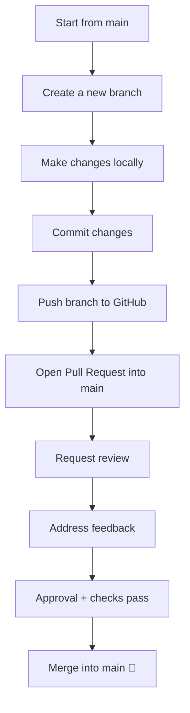

# Contributing Guidelines

Welcome to the project! 🎉  
This document explains how we work together. Please read it carefully before contributing.

---

## 📌 Branching Strategy

- **`main`** is our protected branch. No one pushes directly to `main`.
- All work must be done on **feature branches**:
  - `feature/<name>` → new features (e.g., `feature/login-page`)
  - `bugfix/<name>` → bug fixes (e.g., `bugfix/cart-total`)
  - `hotfix/<name>` → urgent fixes to `main` (e.g., `hotfix/payment-error`)

---

## 🔄 Workflow

