# Contributing Guidelines

Welcome to the project! 🎉  
This document explains how we work together. Please read it carefully before contributing.

---

## 📌 Branching Strategy

- **`main`** is our protected branch. No one pushes directly to `main`.
- All work must be done on **feature branches**:
  - `feature/<name>` → new features (e.g., `feature/login-page`)
  - `bugfix/<name>` → bug fixes (e.g., `bugfix/cart-total`)
  - `hotfix/<name>` → urgent fixes to `main` (e.g., `hotfix/payment-error`)

---

## 🔄 Workflow

```mermaid
flowchart TD
    A[Start from main] --> B[Create a new branch]
    B --> C[Make changes locally]
    C --> D[Commit changes]
    D --> E[Push branch to GitHub]
    E --> F[Open Pull Request into main]
    F --> G[Request review]
    G --> H[Address feedback]
    H --> I[Approval + checks pass]
    I --> J[Merge into main 🎉]
```

